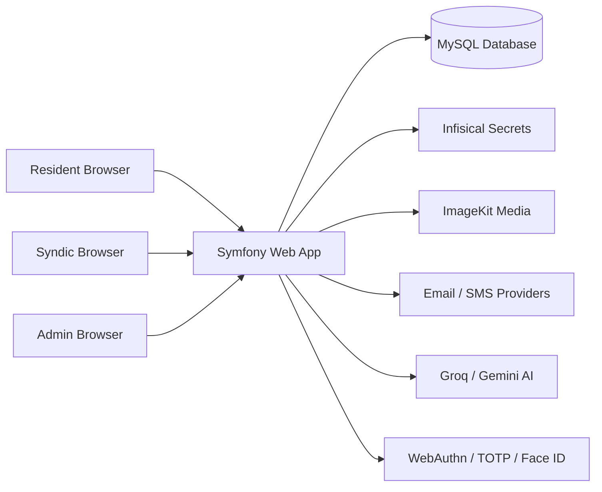
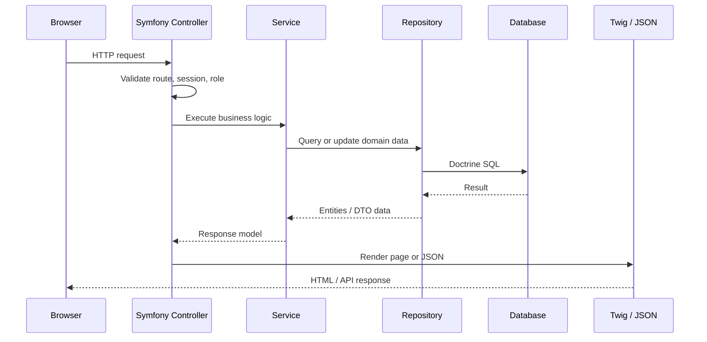
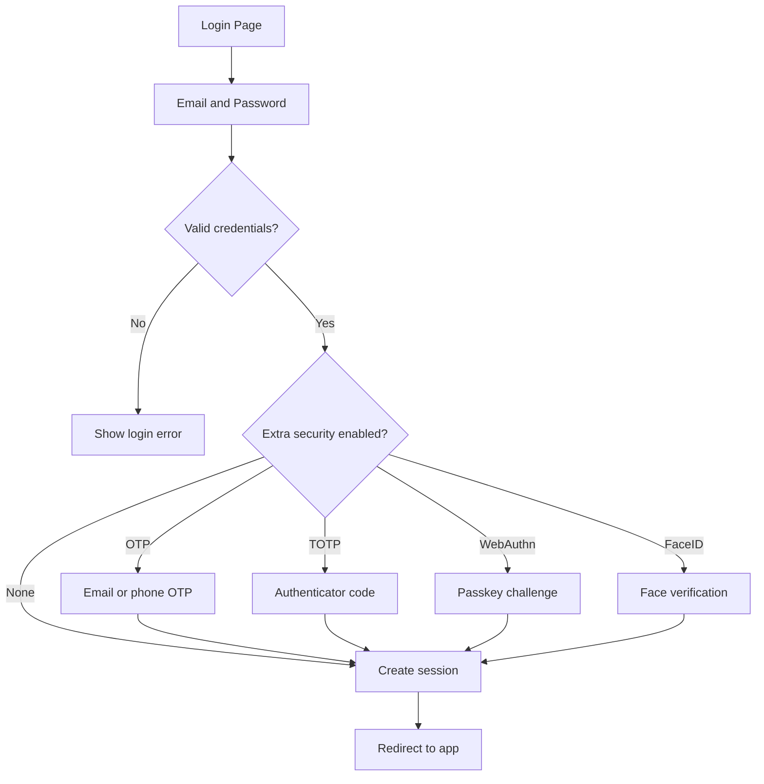
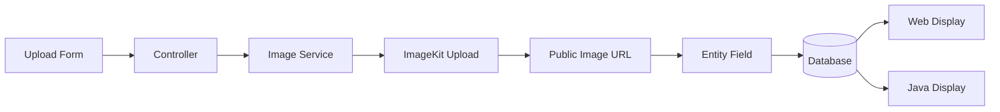
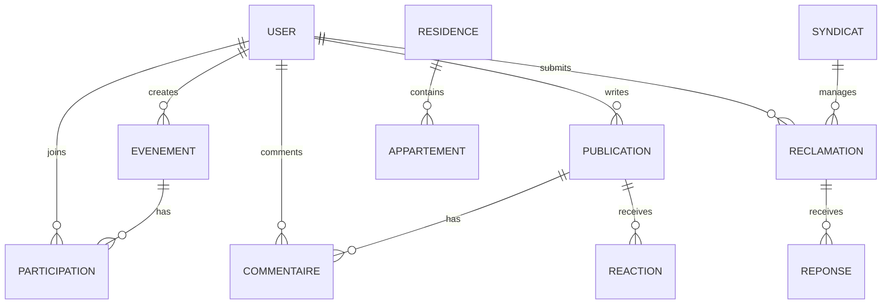
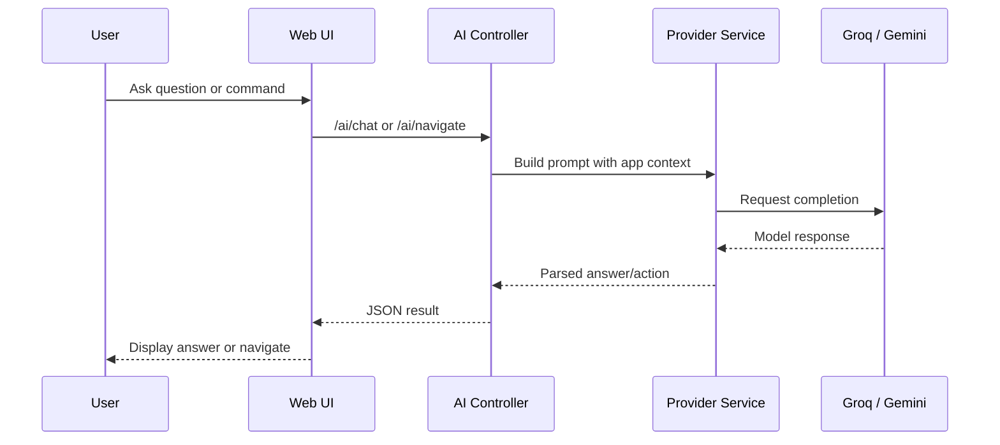

# Syndicati Web - Diagrams

## 1. System Context

```mermaid
flowchart LR
    Resident[Resident Browser]
    Syndic[Syndic Browser]
    Admin[Admin Browser]

    Resident --> Web[Symfony Web App]
    Syndic --> Web
    Admin --> Web

    Web --> DB[(MySQL Database)]
    Web --> Infisical[Infisical Secrets]
    Web --> ImageKit[ImageKit Media]
    Web --> Mailer[Email / SMS Providers]
    Web --> AI[Groq / Gemini AI]
    Web --> Auth[WebAuthn / TOTP / Face ID]
```

## 2. Request Lifecycle

```mermaid
sequenceDiagram
    participant B as Browser
    participant C as Symfony Controller
    participant S as Service
    participant R as Repository
    participant D as Database
    participant T as Twig / JSON

    B->>C: HTTP request
    C->>C: Validate route, session, role
    C->>S: Execute business logic
    S->>R: Query or update domain data
    R->>D: Doctrine SQL
    D-->>R: Result
    R-->>S: Entities / DTO data
    S-->>C: Response model
    C->>T: Render page or JSON
    T-->>B: HTML / API response
```

## 3. Authentication Flow

```mermaid
flowchart TD
    Start[Login Page] --> Password[Email and Password]
    Password --> Check{Valid credentials?}
    Check -- No --> Error[Show login error]
    Check -- Yes --> Extra{Extra security enabled?}
    Extra -- OTP --> OTP[Email or phone OTP]
    Extra -- TOTP --> TOTP[Authenticator code]
    Extra -- WebAuthn --> Passkey[Passkey challenge]
    Extra -- FaceID --> Face[Face verification]
    Extra -- None --> Session[Create session]
    OTP --> Session
    TOTP --> Session
    Passkey --> Session
    Face --> Session
    Session --> App[Redirect to app]
```

## 4. Media Upload Flow

```mermaid
flowchart LR
    Form[Upload Form] --> Controller[Controller]
    Controller --> Service[Image Service]
    Service --> ImageKit[ImageKit Upload]
    ImageKit --> Url[Public Image URL]
    Url --> Entity[Entity Field]
    Entity --> DB[(Database)]
    DB --> Web[Web Display]
    DB --> Java[Java Display]
```

## 5. Main Domain Map

```mermaid
erDiagram
    USER ||--o{ EVENEMENT : creates
    USER ||--o{ PARTICIPATION : joins
    USER ||--o{ PUBLICATION : writes
    USER ||--o{ COMMENTAIRE : comments
    USER ||--o{ RECLAMATION : submits

    RESIDENCE ||--o{ APPARTEMENT : contains
    EVENEMENT ||--o{ PARTICIPATION : has
    PUBLICATION ||--o{ COMMENTAIRE : has
    PUBLICATION ||--o{ REACTION : receives
    SYNDICAT ||--o{ RECLAMATION : manages
    RECLAMATION ||--o{ REPONSE : receives
```

## 6. AI Agent Flow

```mermaid
sequenceDiagram
    participant U as User
    participant UI as Web UI
    participant A as AI Controller
    participant P as Provider Service
    participant M as Groq / Gemini

    U->>UI: Ask question or command
    UI->>A: /ai/chat or /ai/navigate
    A->>P: Build prompt with app context
    P->>M: Request completion
    M-->>P: Model response
    P-->>A: Parsed answer/action
    A-->>UI: JSON result
    UI-->>U: Display answer or navigate
```
